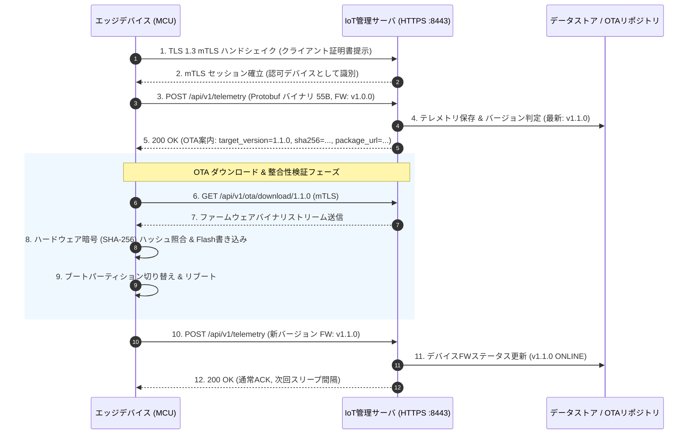

# 01. システムアーキテクチャ・通信・セキュリティ仕様書

## 1. 通信プロトコル概要
- **基本通信方式**: HTTPS POST / GET
- **認証方式**: 相互TLS (mTLS) + デバイス固有証明書 (X.509)
- **ゼロトラスト原則**: サーバ側は全ての受信コネクションでクライアント証明書の検証・有効性（失効リスト等）を確認。
- **ペイロード形式**: 
  - **JSON (`application/json`)**: 初期デバッグ・可読性重視 (サイズ: 約290B)
  - **Protocol Buffers v3 (`application/x-protobuf`)**: **省電力・低通信量運用** (サイズ: 約55B, **約81%削減**)

---

## 2. ペイロード効率ベンチマーク

| 項目 | JSON 形式 | Protocol Buffers (v3) 形式 | 削減率 |
| :--- | :--- | :--- | :--- |
| **平均ペイロードサイズ** | **293 Bytes** | **55〜75 Bytes** | **約 74% 〜 81% 削減** |
| **パース処理オーバーヘッド** | 文字列パース・浮動小数点変換 | Varint / Fixed32 ダイレクトバイナリ | **CPU負荷・RAM消費 大幅低減** |
| **無線通信所要時間** | 長（バッテリ消費大） | 短（RFアクティブ時間を最小化） | **省電力性 向上** |

---

## 3. ハードウェア・セキュリティアーキテクチャ (ゼロトラスト・HSM)

```mermaid
graph TD
    subgraph "Edge Device (MCU + Secure Element)"
        MCU["Application Core<br/>(STM32 / ESP32)"]
        SE["Secure Element / HSM<br/>(ATECC608A / OPTIGA Trust)"]
        Flash["Flash Memory<br/>(AES-XTS 暗号化)"]
        
        MCU -- "I2C (署名要求 & ダイジェスト 32B)" --> SE
        SE -- "ECDSA-P256 署名 (64B)" --> MCU
        Note over SE: 秘密鍵 (Slot 0) は<br/>チップ外に絶対に出ない
    end

    subgraph "Server (mTLS)"
        Server["IoT Management Server"]
    end

    MCU -- "TLS 1.3 Handshake (CertificateVerify)" --> Server
```

- **秘密鍵の完全隔離**: クライアント証明書の秘密鍵はセキュアエレメント（ATECC608A 等）のスロット0に格納され、マイコンのメモリや Flash に平文で存在しない。
- **耐タンパー性**: JTAG デバッグや Flash デキャッピング攻撃を受けても秘密鍵の抽出は不可能。
- **署名演算の委譲**: mTLS ハンドシェイクの `CertificateVerify` 処理時のみ、I2C 経由で SHA-256 ダイジェストを渡し、チップ内部で ECDSA 署名を生成。


