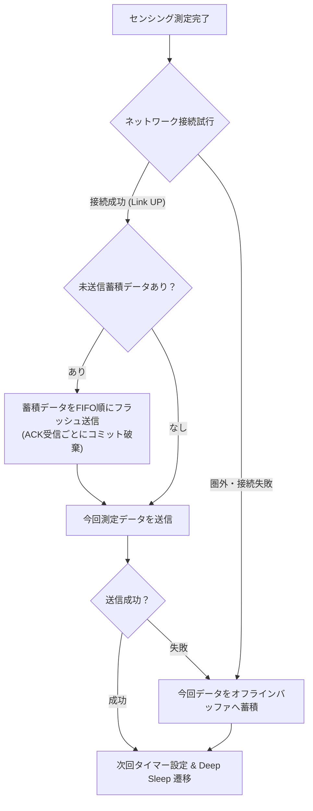

# 02. エッジ要件・HAL/OSAL・省電力仕様書

## 1. エッジアーキテクチャ概要
- **ポータビリティ原則**: アプリケーション層 (`app/`) は特定のマイコンペリフェラルレジスタやRTOS APIに直接依存しない。
- **HAL (Hardware Abstraction Layer)**: 全てのハードウェアアクセス（GPIO, I2C, ADC, ネットワーク, 暗号HW, スリープ, Flash/OTA）を抽象化。
- **OSAL (OS Abstraction Layer)**: 全てのOS機能（タスク, キュー, セマフォ, タイマー）を抽象化し、FreeRTOS / Zephyr / PC Mock に対応可能とする。
- **高信頼性設計**: 通信圏外・一時障害時のデータ欠落を防ぐ **オフラインリングバッファ (`telemetry_buffer`)** を搭載。

---

## 2. オフラインバッファリング & 自動フラッシュ仕様

---

## 3. インターフェース構成一覧

### 3.1 OSAL (OS Abstraction Layer) - [`edge/osal/include/`](file:///x:/iot-platform-project/edge/osal/include/)
| ヘッダファイル | 機能 | 役割 |
| :--- | :--- | :--- |
| [`osal_types.h`](file:///x:/iot-platform-project/edge/osal/include/osal_types.h) | 共通型 | エラーコード (`osal_status_t`)、待機定数 |
| [`osal_task.h`](file:///x:/iot-platform-project/edge/osal/include/osal_task.h) | タスク管理 | タスク生成・削除、ディレイ、システム時刻 |
| [`osal_queue.h`](file:///x:/iot-platform-project/edge/osal/include/osal_queue.h) | キュー | イベント送受信（ISR対応、ブロッキング待機） |
| [`osal_mutex.h`](file:///x:/iot-platform-project/edge/osal/include/osal_mutex.h) | 排他制御 | ミューテックス、バイナリ/カウンティングセマフォ |
| [`osal_timer.h`](file:///x:/iot-platform-project/edge/osal/include/osal_timer.h) | タイマー | ワンショット/周期ソフトウェアタイマー |
| [`osal.h`](file:///x:/iot-platform-project/edge/osal/include/osal.h) | 総合ヘッダ | 初期化・スケジューラ起動 |

### 3.2 HAL (Hardware Abstraction Layer) - [`edge/hal/include/`](file:///x:/iot-platform-project/edge/hal/include/)
| ヘッダファイル | 機能 | 役割 |
| :--- | :--- | :--- |
| [`hal_types.h`](file:///x:/iot-platform-project/edge/hal/include/hal_types.h) | 共通型 | エラーコード (`hal_status_t`) |
| [`hal_gpio.h`](file:///x:/iot-platform-project/edge/hal/include/hal_gpio.h) | GPIO / 外部割込 | 入出力制御、立ち上がり/立ち下がり割り込みISR登録 |
| [`hal_i2c.h`](file:///x:/iot-platform-project/edge/hal/include/hal_i2c.h) | I2C バス | 温湿度センサ等の読み書き |
| [`hal_adc.h`](file:///x:/iot-platform-project/edge/hal/include/hal_adc.h) | ADC | バッテリ電圧監視等の ADC |
| [`hal_network.h`](file:///x:/iot-platform-project/edge/hal/include/hal_network.h) | 通信 & mTLS | Wi-Fi/LTE 接続管理 & mTLS HTTPS POST 送信 |
| [`hal_sleep.h`](file:///x:/iot-platform-project/edge/hal/include/hal_sleep.h) | 省電力・スリープ | Deep / Light Sleep、タイマー/GPIO起床設定 |
| [`hal_crypto.h`](file:///x:/iot-platform-project/edge/hal/include/hal_crypto.h) | 暗号HW | ハードウェア乱数 (TRNG)、SHA-256 |
| [`hal_ota.h`](file:///x:/iot-platform-project/edge/hal/include/hal_ota.h) | Flash / OTA | パーティション書き込み、ブート設定、リブート |
| [`hal.h`](file:///x:/iot-platform-project/edge/hal/include/hal.h) | 総合ヘッダ | HAL共通初期化 |

### 3.3 ミドルウェア層 - [`edge/middleware/`](file:///x:/iot-platform-project/edge/middleware/)
| ファイル | 機能 | 役割 |
| :--- | :--- | :--- |
| [`telemetry_serializer.h`](file:///x:/iot-platform-project/edge/middleware/serializer/telemetry_serializer.h) | JSON シリアライザ | JSON 文字列生成 |
| [`protobuf_serializer.h`](file:///x:/iot-platform-project/edge/middleware/serializer/protobuf_serializer.h) | Protobuf シリアライザ | Protocol Buffers v3 バイナリ生成 (75B) |
| [`telemetry_buffer.h`](file:///x:/iot-platform-project/edge/middleware/telemetry/telemetry_buffer.h) | オフラインバッファ | 通信圏外時のリングバッファ蓄積 & 再送 |
| [`ota_client.h`](file:///x:/iot-platform-project/edge/middleware/ota/ota_client.h) | OTA クライアント | SHA-256検証 & Flash書き込み制御 |
