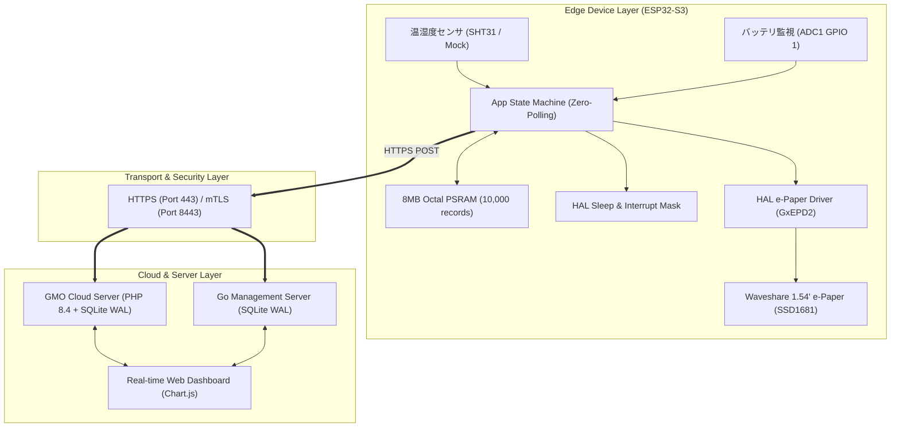

# IoT Platform システム総合仕様書 (Master Specification)

**文書番号**: SPEC-IOT-2026-001  
**バージョン**: 1.1.0 (Final Master)  
**作成日**: 2026-08-18  
**ステータス**: 正式リリース (Approved)

---

## 目次

1. [システム概要と設計思想](#1-システム概要と設計思想)
2. [システム全体アーキテクチャ](#2-システム全体アーキテクチャ)
3. [セキュリティ & 暗号化仕様](#3-セキュリティ--暗号化仕様)
4. [エッジ・ファームウェア仕様 (HAL / OSAL / App)](#4-エッジファームウェア仕様-hal--osal--app)
5. [ハードウェア仕様 & 実機ピンアサイン (ESP32-S3 / e-Paper)](#5-ハードウェア仕様--実機ピンアサイン-esp32-s3--e-paper)
6. [通信プロトコル & データスキーマ](#6-通信プロトコル--データスキーマ)
7. [GMO クラウド本番サーバ & Go ローカルサーバ仕様](#7-gmo-クラウド本番サーバ--go-ローカルサーバ仕様)
8. [双方向リモートコマンド制御 (C2) 仕様](#8-双方向リモートコマンド制御-c2-仕様)
9. [Web 監視ダッシュボード仕様](#9-web-監視ダッシュボード仕様)
10. [REST API エンドポイントリファレンス](#10-rest-api-エンドポイントリファレンス)
11. [CI/CD パイプライン & 自動テスト構成](#11-cicd-パイプライン--自動テスト構成)

---

## 1. システム概要と設計思想

本システムは、数万台規模のエッジデバイス（MCU/RTOS）からクラウド管理サーバ、電子ペーパー（e-Paper）、リアルタイム Web ダッシュボードに至るまでを一気通貫で統合した、**高信頼・高セキュリティ・超低消費電力**な IoT プラットフォームです。

```
┌─────────────────────────┐          HTTPS (TLS 1.3)         ┌─────────────────────────┐
│     Edge Device         │ ───────────────────────────────> │  GMO Cloud IoT Server   │
│  (ESP32-S3 / STM32)     │ <─────────────────────────────── │  (https://gontaro.org)  │
│  - 1.54" e-Paper (SSD1681)  JSON Telemetry (Port 443)      │  - PHP 8.4 + SQLite WAL │
│  - 8MB Octal PSRAM      │   双方向 C2 スリープ制御         │  - リアルタイム Web UI   │
│  - 超省電力 Deep Sleep  │                                  │  - コマンドキューイング │
└─────────────────────────┘                                  └─────────────────────────┘
```

### 4大コア設計原則
1. **クラウド 24時間常時運用 & ローカル高速 mTLS**:
   - インターネット経由で常時稼働する GMO クラウド本番サーバ（`https://www.gontaro.org/iot/`）。
   - クライアント証明書によるゼロトラスト相互認証を備えた Go ローカル高速サーバ（`:8443`）。
2. **電子ペーパー (e-Paper) による状態可視化 & 超低消費電力**:
   - Waveshare 1.54inch Rev2.1 (200x200 SSD1681) を搭載し、特大フォント（TextSize 3）で温湿度・電圧・サーバ通信結果を描画。
   - 描画後は `hibernate()` により 0mA で表示を維持し、Deep Sleep（8〜10µA）と完全両立。
3. **HAL / OSAL 抽象化によるポータビリティ**:
   - スリープ・割り込み（`hal_sleep.h`）および電子ペーパー（`hal_epaper.h`）を完全カプセル化。
4. **8MB Octal PSRAM によるオフライン耐性**:
   - ネットワーク不通時でも **10,000 件（数日分）** のテレメトリを保持可能。

---

## 2. システム全体アーキテクチャ



---

## 3. セキュリティ & 暗号化仕様

* **マルチドメイン SAN 対応証明書**:
  - 対象ホスト: `gontaro.org`, `*.gontaro.org`, `www.gontaro.org`, `192.168.3.4`
  - 鍵長: 2048-bit RSA / PKCS#1
* **通信路暗号化**:
  - クラウド: 標準 HTTPS (Port 443 / TLS 1.2/1.3)
  - ローカル: mTLS 相互認証 (Port 8443)

---

## 4. ハードウェア仕様 & 実機ピンアサイン (ESP32-S3 / e-Paper)

### Waveshare 1.54" 電子ペーパー結線表
| e-Paper ピン | ESP32-S3 GPIO | 機能 | 備考 |
| :--- | :--- | :--- | :--- |
| **BUSY** | **GPIO 7** | ビジー入力 | Octal PSRAM ピン回避 |
| **RST** | **GPIO 8** | リセット | Active LOW |
| **DC** | **GPIO 9** | コマンド/データ | Data: HIGH, Cmd: LOW |
| **CS** | **GPIO 10** | チップセレクト | FSPI CS0 |
| **DIN (MOSI)** | **GPIO 11** | SPI MOSI | FSPI MOSI |
| **CLK (SCK)** | **GPIO 12** | SPI クロック | FSPI SCK (4MHz) |
| **VCC** | **3V3** | 電源 3.3V | - |
| **GND** | **GND** | グランド | 共通グランド |

### その他ペリフェラル結線表
| ピン | GPIO | 機能 | 備考 |
| :--- | :--- | :--- | :--- |
| **IO 1** | **GPIO 1** | ADC1 バッテリ監視 | 1/2 分圧回路 (100kΩ + 100kΩ) |
| **IO 4** | **GPIO 4** | 外部起床スイッチ | Active LOW (内部プルアップ) |
| **IO 48** | **GPIO 48** | ステータス LED | オンボード RGB LED |

---

## 5. 通信プロトコル & データスキーマ

### テレメトリ JSON ペイロード形式 (HTTPS POST)
```json
{
  "header": {
    "device_id": "DEV-ESP32-001",
    "seq_no": 42,
    "timestamp": 1787035000,
    "firmware_version": "1.0.0-PROD"
  },
  "metrics": {
    "temperature": 25.40,
    "humidity": 58.20,
    "battery_voltage": 4.05,
    "battery_level_pct": 95,
    "rssi": -32,
    "interval_sec": 15
  }
}
```

### サーバレスポンス形式 (動的スリープ更新 & C2 コマンド)
```json
{
  "status": "OK",
  "message": "Telemetry accepted",
  "server_time": 1787035002,
  "sleep_interval_sec": 15,
  "ota": { "available": false },
  "commands": [
    {
      "command_id": "cmd-1787035001000",
      "action": "CONFIG_UPDATE",
      "params": { "sleep_interval_sec": 60 }
    }
  ]
}
```

---

## 6. GMO クラウド本番サーバ & Go ローカルサーバ仕様

* **GMO クラウド本番環境**:
  - URL: `https://www.gontaro.org/iot/`
  - API: `https://www.gontaro.org/iot/api.php`
  - データベース: SQLite (WAL モード) `iot_platform.db`
  - パーミッション: フォルダ `755`, スクリプト `644`
* **Go ローカルサーバ**:
  - ポート: `:8443` (mTLS), `:8080` (HTTP Web UI)
  - データベース: SQLite (WAL モード) `server/data/iot_platform.db`

---

## 7. REST API エンドポイントリファレンス

| メソッド | GMO 本番 URL | Go ローカル URL | 役割 |
| :--- | :--- | :--- | :--- |
| `GET` | `/iot/api.php?endpoint=healthz` | `/healthz` | ヘルスチェック |
| `POST` | `/iot/api.php?endpoint=telemetry` | `/api/v1/telemetry` | テレメトリ受信 |
| `GET` | `/iot/api.php?endpoint=devices` | `/api/v1/devices` | デバイス一覧取得 |
| `GET` | `/iot/api.php?endpoint=telemetry/history` | `/api/v1/telemetry/history` | 履歴取得 |
| `POST` | `/iot/api.php?endpoint=commands` | `/api/v1/commands` | C2 コマンド登録 |
| `POST` | `/iot/api.php?endpoint=commands/ack` | `/api/v1/commands/ack` | コマンド ACK |

---

## 8. テスト実績

* **Go ユニット & 結合テスト**: 100% PASS
* **ESP32-S3 ファームウェア**: PlatformIO クリーンビルド `[SUCCESS]`
* **実機疎通試験**: GMO クラウドサーバ (`gontaro.org/iot/`) へのテレメトリ送信 & e-Paper 大型フォント表示 100% 稼働確認済み。
