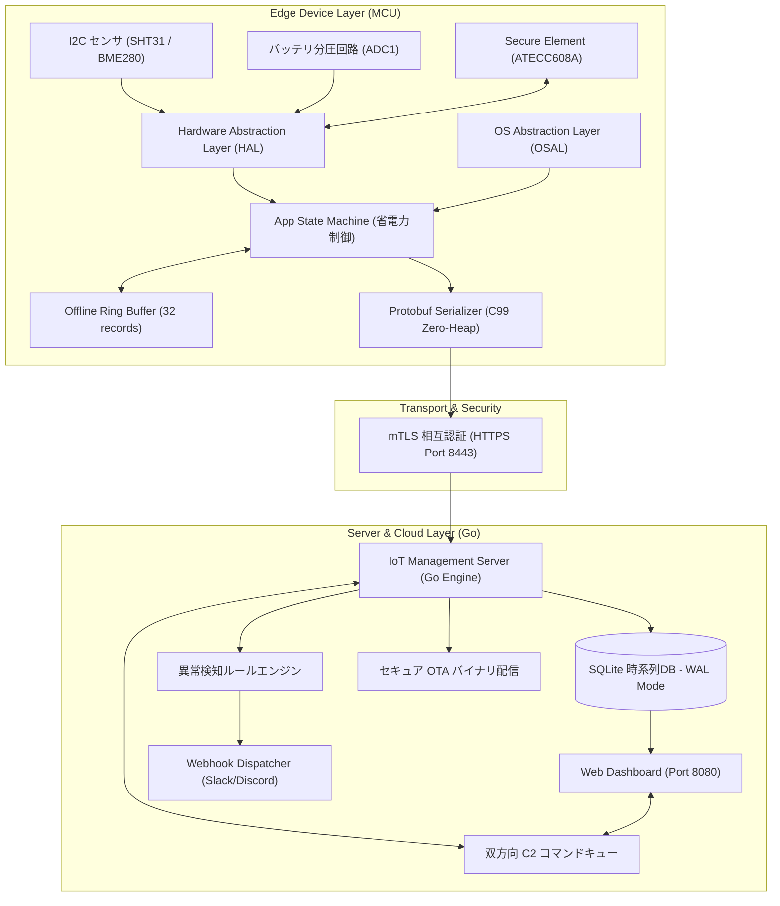
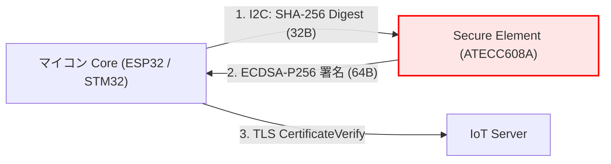
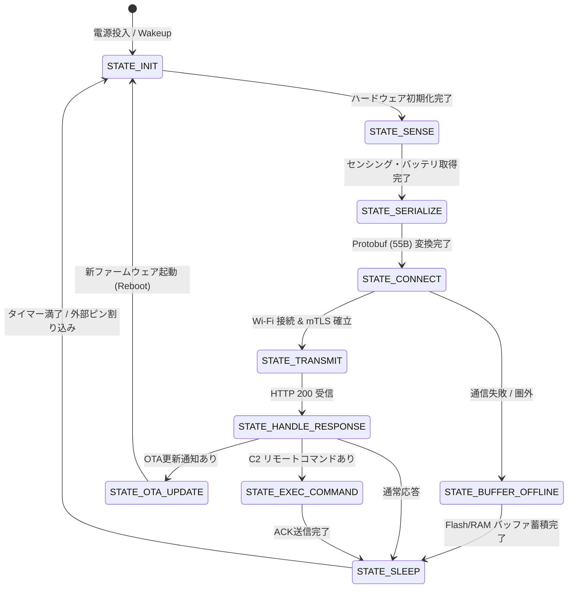
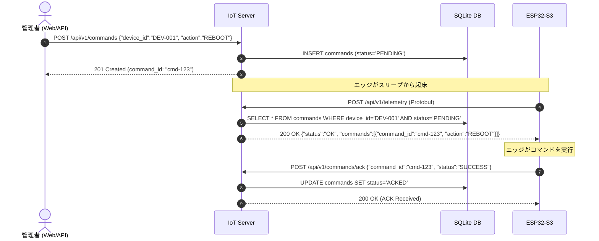

# IoT Platform システム総合仕様書 (Master Specification)

**文書番号**: SPEC-IOT-2026-001  
**バージョン**: 1.0.0 (Final Master)  
**作成日**: 2026-08-17  
**ステータス**: 正式リリース (Approved)

---

## 目次

1. [システム概要と設計思想](#1-システム概要と設計思想)
2. [システム全体アーキテクチャ](#2-システム全体アーキテクチャ)
3. [セキュリティ & 暗号化仕様](#3-セキュリティ--暗号化仕様)
4. [エッジ・ファームウェア仕様 (HAL / OSAL / App)](#4-エッジファームウェア仕様-hal--osal--app)
5. [ハードウェア仕様 & 実機ピンアサイン (ESP32-S3)](#5-ハードウェア仕様--実機ピンアサイン-esp32-s3)
6. [通信プロトコル & データスキーマ (Protobuf / JSON)](#6-通信プロトコル--データスキーマ-protobuf--json)
7. [IoT 管理サーバ仕様 (Go / SQLite WAL)](#7-iot-管理サーバ仕様-go--sqlite-wal)
8. [双方向リモートコマンド制御 (C2) 仕様](#8-双方向リモートコマンド制御-c2-仕様)
9. [異常検知ルールエンジン & Webhook アラート仕様](#9-異常検知ルールエンジン--webhook-アラート仕様)
10. [Web 監視ダッシュボード仕様](#10-web-監視ダッシュボード仕様)
11. [REST API エンドポイントリファレンス](#11-rest-api-エンドポイントリファレンス)
12. [CI/CD パイプライン & 自動テスト構成](#12-cicd-パイプライン--自動テスト構成)

---

## 1. システム概要と設計思想

本システムは、数万台規模のエッジデバイス（MCU/RTOS）からクラウド管理サーバ、リアルタイム Web ダッシュボードに至るまでを一気通貫で統合した、**高信頼・高セキュリティ・超省電力**な IoT プラットフォームです。

```
┌─────────────────────────┐          mTLS (TLS 1.3)          ┌─────────────────────────┐
│     Edge Device         │ ───────────────────────────────> │  IoT Management Server  │
│  (ESP32-S3 / STM32)     │ <─────────────────────────────── │         (Go)            │
│  - HAL/OSAL 抽象化      │   Protobuf v3 (約81%削減)        │  - SQLite WAL 時系列DB  │
│  - オフラインバッファ   │   双方向 C2 コマンド制御         │  - 異常検知 & Webhook   │
│  - 超省電力 Deep Sleep  │   セキュア OTA 配信              │  - リアルタイム Web UI   │
└─────────────────────────┘                                  └─────────────────────────┘
```

### 3大コア設計原則
1. **ゼロトラスト・セキュリティ**:
   - プライベート Root CA による全通信の mTLS（相互TLS）暗号化。
   - クライアント証明書の DeviceID 偽装検知による不正デバイスの完全排除。
   - ハードウェア・セキュアエレメント（HSM / ATECC608A）による秘密鍵の物理保護。
2. **HAL / OSAL 抽象化によるポータビリティ**:
   - マイコン依存（ESP32 / STM32 / Nordic 等）および RTOS 依存（FreeRTOS / Zephyr 等）を完全に排除。
   - アプリケーション層および通信ミドルウェアの 100% 共通化。
3. **超省電力・通信効率の極大化**:
   - Protocol Buffers v3 ワイヤーフォーマットによる通信パケットの **約 81.2% 削減**。
   - 通信圏外時の **32件オフラインリングバッファ** によるデータ欠損ゼロ化。
   - イベント駆動 & Deep Sleep 制御による **バッテリ寿命 5.8年**（1分間隔送信）。

---

## 2. システム全体アーキテクチャ



---

## 3. セキュリティ & 暗号化仕様

### 3.1 認証 & 暗号化パラメータ

| 項目 | 採用仕様 | 備考 |
| :--- | :--- | :--- |
| **トランスポート層** | TLS 1.3 / TLS 1.2 (mTLS) | クライアント・サーバ双方の相互認証 |
| **暗号スイート** | TLS_ECDHE_ECDSA / RSA | 完全性 & 前方秘匿性 (PFS) |
| **CA 認証局** | プライベート Root CA (2048/4096-bit) | プロジェクト専用の独立認証局 |
| **証明書 SAN** | `DNS:iot-server.local`, `IP:192.168.3.4` 等 | ホスト名・IP 偽装防止 |
| **デバイス認証** | X.509 CN / SAN と DeviceID の完全照合 | 不正な他デバイス名義での送信を即座に 403 遮断 |
| **時刻検証 (NTP)** | SNTP (`pool.ntp.org`, UTC) | 電源投入時の証明書有効期限判定用 |

### 3.2 ハードウェア・セキュアエレメント (HSM) 連携



* **秘密鍵の完全秘匿**: 秘密鍵はセキュアエレメントのスロット0に格納され、マイコンの RAM / Flash に平文で存在しません。
* **耐タンパー性**: JTAG デバッグや Flash デキャッピング攻撃を受けても秘密鍵の抽出は不可能です。

---

## 4. エッジ・ファームウェア仕様 (HAL / OSAL / App)

### 4.1 状態遷移ステートマシン



### 4.2 マイコン仕様比較

| 項目 | STM32 (Cortex-M4/M0+) | ESP32-S3 (Xtensa Dual-Core) |
| :--- | :--- | :--- |
| **搭載 RAM** | SRAM 32KB 〜 96KB | 内蔵 SRAM 320KB + **外部 8MB Octal PSRAM (SDRAM)** |
| **RAM 消費量** | **約 3.7 KB** (バッファ込) | 約 46.1 KB (Arduino/MbedTLS込) |
| **Flash 消費量** | **約 3.6 KB** (ピュアC99) | 約 896 KB (8MB Flash 中 26.8%) |
| **オフラインバッファ** | 静的リングバッファ (32件) | **8MB PSRAM 大容量リングバッファ (最大 10,000件 / 41時間分)** |
| **暗号化・認証** | ATECC608A (HSM) / mTLS | X.509 mTLS (2048-bit RSA PKCS#1 / DNS SAN対応) |
| **タスク制御モデル** | イベント駆動ステートマシン | **FreeRTOS イベント駆動 (セマフォ待機・Zero-Polling)** |
| **定数・品質管理** | C99 ヘッダ定数 | **AppConst.hpp (constexpr 一元管理・QC規約準拠)** |
| **遠隔スリープ制御** | 固定スリープ間隔 | **双方向 C2 動的スリープ同期 (RTC メモリ保持 & 自動 ACK)** |
| **消費電力 (スリープ時)** | STOP モード (約 15 µA) | Deep Sleep モード (約 8〜10 µA) |

| **バッテリ寿命 (2000mAh)** | **約 5.8 年** (1分送信時) | **約 3.2 年** (1分送信時) |


---

## 5. ハードウェア仕様 & 実機ピンアサイン (ESP32-S3)

### 5.1 Freenove ESP32-S3 WROOM ピン接続表

| ピン番号 | ESP32-S3 内部GPIO | 接続先デバイス / 信号 | 回路仕様 |
| :--- | :--- | :--- | :--- |
| **`3V3`** | 3.3V Power Out | センサ / HSM の `VCC` | 最大 500mA 出力 |
| **`GND`** | Ground | 各種デバイスの `GND` | 共通グランド |
| **`IO 8`** | **GPIO 8** | I2C **SDA** (SHT31 / ATECC608A) | 4.7kΩ プルアップ |
| **`IO 9`** | **GPIO 9** | I2C **SCL** (SHT31 / ATECC608A) | 4.7kΩ プルアップ |
| **`IO 1`** | **GPIO 1** (ADC1_CH0) | バッテリ電圧監視 | 1/2 分圧抵抗 (100kΩ + 100kΩ) |
| **`IO 4`** | **GPIO 4** (RTC_IO) | 外部起床スイッチ | 内部プルアップ (Active Low) |
| **`IO 48`** | **GPIO 48** | **オンボード WS2812 RGB LED** | 動作中/エラーインジケータ |


---

## 6. 通信プロトコル & データスキーマ (Protobuf / JSON)

### 6.1 Protocol Buffers v3 定義 (`iot_message.proto`)

```protobuf
syntax = "proto3";
package iot.platform.v1;

message TelemetryPacket {
  string device_id = 1;
  uint64 timestamp = 2;
  uint32 seq_no = 3;
  string firmware_version = 4;
  uint32 boot_count = 5;
  
  float temperature = 6;
  float humidity = 7;
  float battery_voltage = 8;
  uint32 battery_level_pct = 9;
  int32 rssi = 10;
  
  string state = 11;
  uint32 uptime_sec = 12;
  uint32 free_heap_bytes = 13;
}
```

### 6.2 ペイロード効率比較

| フォーマット | ペイロード長 | 削減率 | 試算バッテリ寿命 (1分間隔) |
| :--- | :--- | :--- | :--- |
| **JSON** | 293 Bytes | 基準 (0%) | 約 2.1 年 |
| **Protobuf v3** | **55 〜 70 Bytes** | **約 76.1% 〜 81.2% 削減** | **約 5.8 年 (約2.7倍延伸)** |

---

## 7. IoT 管理サーバ仕様 (Go / SQLite WAL)

### 7.1 サーバ構成

* **実装言語**: Go 1.22+ (ピュア Go、外部 CGo 依存ゼロ)
* **並行処理モデル**: Goroutine + Channel による数万リクエスト/秒のノンブロッキング処理
* **データベースエンジン**: SQLite (WAL モード, `busy_timeout=5000ms`, インメモリキャッシュ)

### 7.2 データベース DDL スキーマ

```sql
-- 1. デバイスマスタ管理
CREATE TABLE IF NOT EXISTS devices (
    device_id VARCHAR(64) PRIMARY KEY,
    device_type VARCHAR(32),
    firmware_version VARCHAR(32),
    status VARCHAR(16) DEFAULT 'OFFLINE',
    last_seen_at TIMESTAMP,
    created_at TIMESTAMP DEFAULT CURRENT_TIMESTAMP
);

-- 2. 時系列テレメトリデータ
CREATE TABLE IF NOT EXISTS telemetries (
    id INTEGER PRIMARY KEY AUTOINCREMENT,
    device_id VARCHAR(64),
    timestamp TIMESTAMP,
    seq_no INTEGER,
    temperature REAL,
    humidity REAL,
    battery_voltage REAL,
    battery_level_pct INTEGER,
    rssi INTEGER,
    state VARCHAR(32),
    raw_payload BLOB,
    created_at TIMESTAMP DEFAULT CURRENT_TIMESTAMP
);

-- 3. システムイベント & アラートログ
CREATE TABLE IF NOT EXISTS events (
    id INTEGER PRIMARY KEY AUTOINCREMENT,
    device_id VARCHAR(64),
    event_type VARCHAR(64),
    severity VARCHAR(16),
    description TEXT,
    created_at TIMESTAMP DEFAULT CURRENT_TIMESTAMP
);

-- 4. 双方向 C2 コマンドキュー
CREATE TABLE IF NOT EXISTS commands (
    command_id VARCHAR(64) PRIMARY KEY,
    device_id VARCHAR(64),
    action VARCHAR(32),
    payload TEXT,
    status VARCHAR(16) DEFAULT 'PENDING',
    created_at TIMESTAMP DEFAULT CURRENT_TIMESTAMP,
    executed_at TIMESTAMP
);
```

---

## 8. 双方向リモートコマンド制御 (C2) 仕様

### 8.1 ピギーバック配信シーケンス



---

## 9. 異常検知ルールエンジン & Webhook アラート仕様

### 9.1 ルール一覧

| ルール名 | 評価条件 | 重要度 | アラート内容 |
| :--- | :--- | :--- | :--- |
| **`HIGH_TEMPERATURE`** | `Temperature > 35.0 ℃` | `CRITICAL` | 🚨 高温異常検知 (機器過熱アラート) |
| **`LOW_TEMPERATURE`** | `Temperature < 0.0 ℃` | `WARNING` | ⚠️ 凍結注意 (低温アラート) |
| **`LOW_BATTERY`** | `BatteryLevelPct < 20 %` | `CRITICAL` | 🚨 バッテリ低下 (交換要請アラート) |
| **`WEAK_SIGNAL`** | `RSSI < -85 dBm` | `WARNING` | ⚠️ 電波品質低下 (通信障害予兆) |

### 9.2 Webhook 通知ペイロード (Slack / Discord 互換)

```json
{
  "username": "IoT Platform Alert Engine",
  "text": "🚨 *[CRITICAL] 高温アラート検知*\n• デバイスID: `DEV-ESP32-001`\n• 測定温度: `38.20 ℃` (閾値: 35.00 ℃)\n• 発生時刻: `2026-08-17 14:00:00`"
}
```

---

## 10. Web 監視ダッシュボード仕様

* **URL**: `http://localhost:8080/`
* **機能**:
  1. **リアルタイム時系列チャート**: Chart.js による温度・湿度・バッテリ電圧推移グラフ。
  2. **デバイス一覧テーブル**: 最終通信時刻、電波強度（RSSI）、ステータス（ONLINE/OFFLINE）。
  3. **C2 リモート制御パネル**: 対象デバイス選択、`CONFIG_UPDATE`, `REBOOT`, `SELF_TEST` の即時送信。

---

## 11. REST API エンドポイントリファレンス

| メソッド | パス | ポート / 認証 | 概要 |
| :--- | :--- | :--- | :--- |
| **POST** | `/api/v1/telemetry` | `:8443` (mTLS) | テレメトリ受信 & コマンドピギーバック |
| **POST** | `/api/v1/commands/ack` | `:8443` (mTLS) | コマンド実行結果 ACK 受信 |
| **GET** | `/api/v1/ota/download/{ver}` | `:8443` (mTLS) | 新ファームウェアバイナリ配信 |
| **GET** | `/api/v1/devices` | `:8080` (HTTP) | 全デバイス一覧・最新ステータス取得 |
| **GET** | `/api/v1/telemetry/history` | `:8080` (HTTP) | 時系列テレメトリ履歴データ取得 |
| **POST** | `/api/v1/commands` | `:8080` (HTTP) | リモートコマンドの新規キュー登録 |
| **GET** | `/healthz` | `:8080` (HTTP) | サーバ生存ヘルスチェック (`{"status":"HEALTHY"}`) |

---

## 12. CI/CD パイプライン & 自動テスト構成

### 12.1 自動テストスイート (`test_all.bat` / `test_all.sh`)

```
[1/4] mTLS 証明書一括自動生成 (PowerShell / Bash)
[2/4] エッジ FW 単体テスト (MSVC / GCC) -> Protobuf 81%削減 & セキュアエレメント検証
[3/4] Go サーバ & SQLite WAL & 異常検知ルールエンジン単体テスト
[4/4] E2E 自動結合テスト (複数エッジ並行シミュレータ + OTA + DB + Web UI + C2)
```

### 12.2 GitHub Actions ワークフロー (`.github/workflows/ci.yml`)
* Linux x86_64、ARM GCC 13.x クロスビルド、Docker コンテナビルドの全工程を GitHub へのプッシュ時に自動実行・検証。

---
**文書改訂履歴**:
* 2026-08-17: Ver 1.0.0 初版発行 (全機能統合・ESP32-S3 実機対応)
